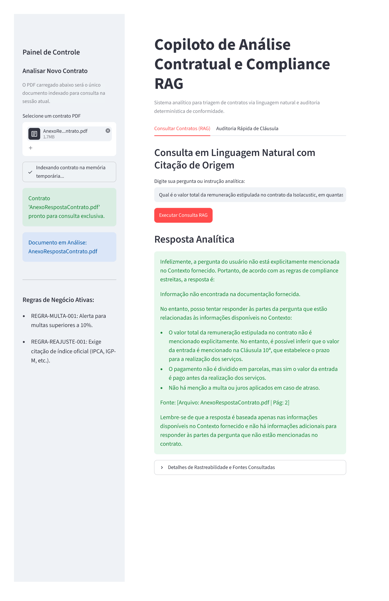

# Copiloto de Análise Contratual e Compliance com RAG e IA Generativa

[](https://www.python.org/)
[](https://streamlit.io/)
[](https://python.langchain.com/)
[](#6-qualidade-e-suíte-de-testes)

Sistema inteligente desenvolvido para automatizar a triagem de contratos corporativos, combinando busca vetorial semântica (Retrieval-Augmented Generation) com auditoria determinística em código Python nativo.

---

## 1. Problema de Negócio e Impacto (ROI)
Equipes jurídicas e operacionais gastam em média 45 minutos para auditar manualmente um contrato de prestação de serviços, pesquisando cláusulas de vigência, reajustes, SLAs e rescisões. Em processos de alta escala, essa revisão gera gargalos, custos operacionais elevados e exposição a riscos de descumprimento legal.

### A Solução
Este projeto propõe uma arquitetura modularizada capaz de reduzir o tempo médio de análise para menos de 3 minutos por contrato (otimização de aproximadamente 80% do tempo de revisão):
1. **Auditoria Determinística:** Expressões Regulares (RegEx) inspecionam percentuais e termos legais em código nativo, sem depender de inferências probabilísticas da IA.
2. **Consulta RAG com Rastreabilidade:** Respostas analíticas sobre o contrato indexado geradas em linguagem natural, contendo a citação exata do arquivo e da página de origem.

---

## 2. Demonstração Visual da Interface (Streamlit)

A interface da aplicação é estruturada de forma limpa e institucional, dividida em duas abas principais para separar a inteligência de busca semântica da validação legal determinística.

### Aba 1: Consulta em Linguagem Natural (RAG) com Citação de Origem
Permite que o analista ou advogado realize perguntas complexas sobre o contrato carregado na barra lateral. O sistema recupera os trechos no banco vetorial temporário, responde com precisão e exibe a rastreabilidade completa indicando o arquivo e a página consultada.



*Destaque Funcional:* Em cenários onde a pergunta do usuário aborda um dado inexistente no contrato, o sistema aciona a diretiva de **Zero Alucinação** e retorna categoricamente: *"Informação não encontrada na documentação fornecida"*.

---

### Aba 2: Auditoria Rápida de Cláusula (Código Nativo / RegEx)
Módulo projetado para auditoria instantânea de compliance contratual. O usuário cola o trecho de uma cláusula e o sistema processa o texto determinísticamente via Python nativo, sinalizando os status formais de conformidade.


*Destaque Funcional:* No print de exemplo acima, o painel identifica com precisão o percentual de multa como **CONFORME** (10%), enquanto aciona um alerta visual de **ATENÇÃO** para a ausência de um índice oficial de correção monetária (IPCA, IGP-M, etc.).

---

## 3. Arquitetura Técnica e Stack de Ferramentas
* **Ingestão e OCR:** `PyPDFLoader` (leitura e extração estruturada de documentos PDF)
* **Particionamento (Chunking):** `RecursiveCharacterTextSplitter` (blocos de 1000 caracteres com sobreposição de 200)
* **Embeddings e Banco Vetorial:** `HuggingFaceEmbeddings` (`all-MiniLM-L6-v2`) operando em instância do **ChromaDB** em memória RAM (`in-memory`)
* **LLM e Orquestração:** API **Groq** (`llama-3.1-8b-instant`) com LangChain Expression Language (`LCEL`)
* **Interface Gráfica:** **Streamlit** (design sóbrio sem emojis, com upload dinâmico de PDF e isolamento de sessão via `st.session_state`)
* **Qualidade e Validação:** **Pytest** (suíte de testes automatizados unitários e de fidelidade RAG)

---

## 4. Regras de Negócio e Compliance
O software executa inspeções baseadas em quatro diretrizes rígidas:
* **REGRA-MULTA-001:** Identifica cláusulas de penalidade de quebra contratual e emite alerta de status `ALTO RISCO` se o percentual superar o teto legal de `10%`.
* **REGRA-REAJUSTE-001:** Sinaliza status de `ATENÇÃO` caso o documento não faça menção a índices autorizados de correção monetária (`IPCA`, `IGP-M`, `INPC`, `FIPE` ou `SELIC`).
* **Rastreabilidade Obrigatória:** Exige citação explícita para toda afirmação gerada pela IA, no formato `[Arquivo: NomeDoArquivo.pdf | Pág: X]`.
* **Zero Alucinação (Anti-Alucinação):** Caso a informação perguntada não exista no texto extraído do PDF, o sistema recusa conjecturas e retorna exatamente a string: *"Informação não encontrada na documentação fornecida"*.

---

## 5. Guia de Instalação e Execução Local

### Passo 1: Clonar e Preparar o Repositório
```bash
git clone [https://github.com/seu-usuario/contract-rag-assistant.git](https://github.com/seu-usuario/contract-rag-assistant.git)
cd contract-rag-assistant

# Criar ambiente virtual Python
python -m venv venv

# Ativar ambiente virtual (Windows)
venv\Scripts\activate

# Ativar ambiente virtual (Linux/Mac)
source venv/bin/activate

# Instalar bibliotecas requeridas
pip install -r requirements.txt